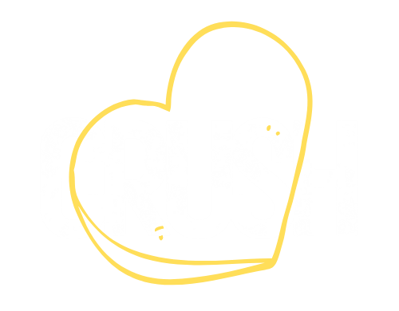

<h1>Crush</h1>

You can view the GitHub pages deployed application [here](https://fudge88.github.io/foodtopia/).

<h2>Table of Contents</h2>

- [Description](#description)
- [User Story](#user-story)
- [Technologies Used](#technologies-used)
- [EndPoints Documentation](#endpoint-documentation)
- [Contributors](#contributors)
- [Improvements](#improvements)
- [Screenshots](#screenshots)
  - [Wireframes](#wireframes)
  - [Final Website](#final-website)
  - [References](#References)

## Description

Crush is a dating app, where people can swipe left or right reflecting their interest, and view profiles to find out peoples intentions from the get-go. Its'intentions' feature makes it compulsory for user to state why they're using the app, from 'FlingTing' and 'Lets see where it goes', to 'Marry Me'.

This means there's no faff and pretence, rather everyone knows where they stand before engaging in a conversation.

A responsive dynamic app which will run in the browser. Crush is an easy to use application, which hold a SQL database to hold, and manage matches. The website requires direct input from the user, where the user signs up and is easily able to navigate through the site. If any 2 users swipe right on one another, this creates a match, and allows the couple to decide on a date.

## User Story

```
AS a user I expect to FIND a main page that gives me an overview of what the app is about.

I would ALSO expect to find 'signing up' and 'logging in' buttons on the same page,

WHEN i click on either buttons, i EXPECT to be taken to a page where i can either login or enter my details and sign up.

i would THEN like to tbe taken to my Profile page.

As a user i WOULD like to have a navbar that would give me easy access to the relevant pages, such as my profile, and the browsing option.

as i browse i should be given the relevant information of other users (potential dates), with the ability to select yes or no as an option of matching.


I WOULD like my first glance at the recipes to give me:

- a image of the dish
- the recipe title
- the time and the calories for

i WOULD also like the option to QUICK save the recipes without having to relocate to a different page, so i can ADD MULTIPLE recipes in one go.

When I CLICK on the 'LETS COOK' on card recipe

I EXPECT to be relocated to that specific recipe page

I WOULD like to see:

- the recipe name,
- the image of the recipe
- a box with the instructions for the recipe
- a box with the methods of how to cook the recipe
- a box with the wine pairing for the recipe
- to ability to see the time, portions, costs and popularity
- one option button (to add to Favorites)
- one option button (to view nutritional value)
- YouTube video links to see the recipe
- calculator to multiply the ingredients depending on servings

When I CLICK on the 'HEART' the recipe SHOULD be saved to 'my favourites'.


When I CLICK on My Favourites link

I EXPECT to be relocated to a page presenting all my SAVED recipe cards

```

## Technologies Used

#### Languages

- HTML5
- CSS
- JavaScript
- JQuery

#### Frameworks used

- Bulma CSS Framework
- Font Awesome
- Google Fonts CDN

#### APIs

- Spoonacular API
- Youtube API

## EndPoints Documentation

[Spoonacular](https://spoonacular.com/food-api) and [YouTube](https://developers.google.com/youtube/v3/getting-started?hl=en) APIs

- Spoonacular is one of the first food management system that combines dining out, eating store-bought food, and cooking at home to help you find and organize the restaurants, products, and recipes that fit your diet and can help you reach your nutrition goals.

- YouTube Data API, you can add a variety of YouTube features to your application. Use the API to upload videos, manage playlists and subscriptions, update channel settings, and more.

## Contributors

- Anab: [https://github.com/anabwarsame](https://github.com/anabwarsame)
- Fahra: [https://github.com/fudge88](https://github.com/fudge88)
- Leanne: [https://github.com/lenny-g](https://github.com/lenny-g)
- Liana: [https://github.com/lianavaleria15](https://github.com/lianavaleria15)
- Luiz: [https://github.com/luizfroes](https://github.com/luizfroes)

## Improvements

- Modal to confirm deletion
- Ability to create a menu planner
- Offer a feedback option
- Present more information on cards
- Save videos to local storage

## Screenshots

### Wireframes

#### INDEX PAGE Large and small screen Wireframe


#### MENU PAGE Large and small screen Wireframe


#### FAVOURITES PAGE Large and small screen Wireframe


#### Large and small screen Wireframe


### Final Website

#### INDEX PAGE screenshot


#### MENU PAGE screenshot


#### FAVOURITES PAGE screenshot


#### RECIPES screenshot


## References

[Background Image by Samuel Berner](https://unsplash.com/@saaam_chan?utm_source=unsplash&utm_medium=referral&utm_content=creditCopyText)

[Flexbox positioning](https://developer.mozilla.org/en-US/docs/Web/CSS/CSS_Flexible_Box_Layout/Aligning_Items_in_a_Flex_Container)

[Webm to Gif converter](https://cloudconvert.com/webm-to-gif)

[Screencastify - screen recording](https://www.screencastify.com/)

[Mozilla.org](https://developer.mozilla.org/en-US/docs/Web/JavaScript/Reference/Global_Objects/Array/forEach)

[StackOverflow](https://stackoverflow.com/questions/9329446/for-each-over-an-array-in-javascript)

[Spoonacular](https://spoonacular.com/food-api)

[YouTube](https://developers.google.com/youtube/v3/getting-started?hl=en)

## License

This project is licensed under the terms of the MIT license.
