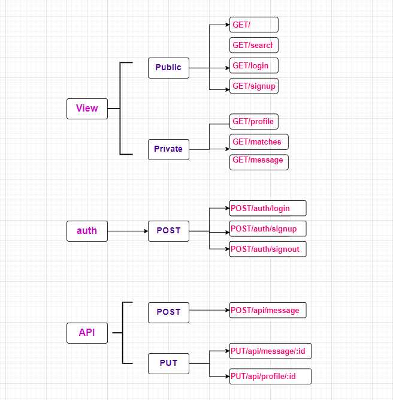
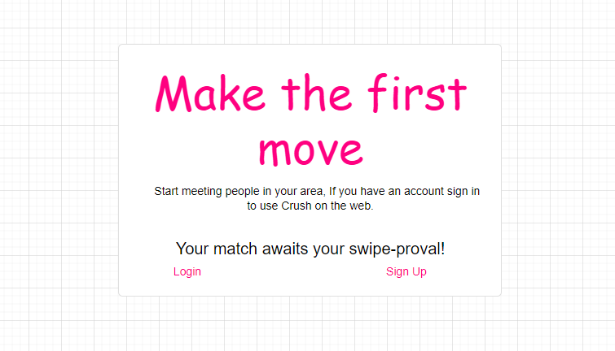
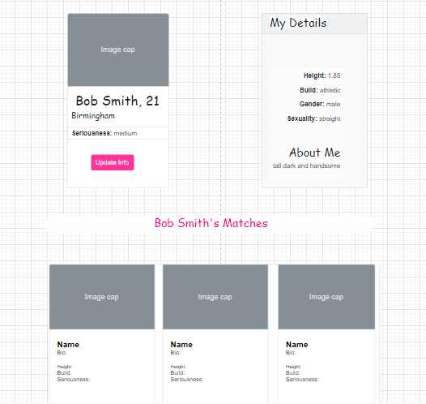
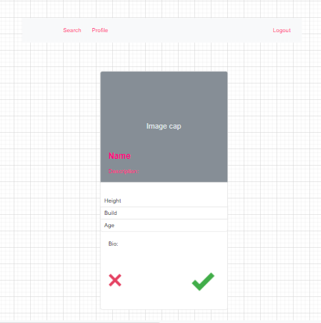
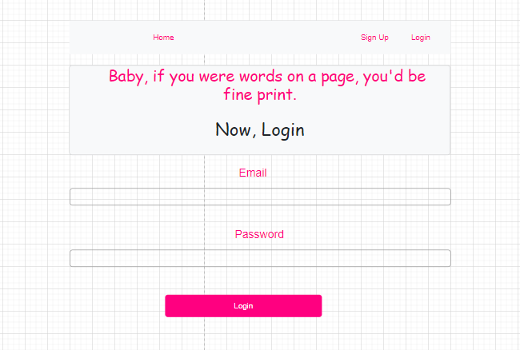
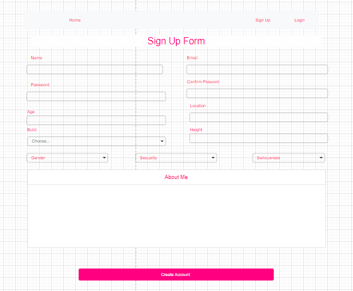

You can view the deployed application [here](https://fudge88.github.io/foodtopia/).

## Table of Contents

- [Summary](#summary)
- [User Story](#user-story)
- [Technologies Used](#technologies-used)
- [Installation](#installation)
- [Contributors](#contributors)
- [Improvements](#improvements)
- [Screenshots](#screenshots)
  - [Wireframes](#wireframes)
  - [Final Website](#final-website)
  - [References](#References)

## Summary

Crush is a dating app, where people can swipe left or right reflecting their interest, and view profiles to find out peoples intentions from the get-go. Its'intentions' feature makes it compulsory for user to state why they're using the app, from 'FlingTing' and 'Lets see where it goes', to 'Marry Me'.

This means there's no faff and pretence, rather everyone knows where they stand before engaging in a conversation.

A responsive dynamic app which will run in the browser. Crush is an easy to use application, which holds a SQL database, and manages matches. The website requires direct input from the user, where the user signs up and is easily able to navigate through the site. If any 2 users swipe right on one-another, this creates a match, and allows the couple to decide on a date.

## User Story

```
AS a user I expect to FIND a main page that gives me an overview of what the app is about.

I would ALSO expect to find some form of navigation on using the app, such as 'signing up' and 'logging in' buttons,

WHEN i click on either buttons, i EXPECT to be taken to a page where i can either login and be relocated to a private page or enter my details and sign up for instant use.

Ideally i would THEN like to be taken to my Profile page. WHERE i can see my matches, and HAVE the ability to update Bio at a later stage.

As a user i WOULD like to have a navbar that would give me easy access to the relevant pages, such as my profile, and the exploring options.

WHEN exploring i SHOULD be given a summary information of other users (potential matches), AND have the ability to view their profile WHEN i click on the card.

I WOULD like my first glance at the user cards to give me:

- image
- name
- age
- location
- and a short summary

The cards SHOULD give me the ability to select yes or no at a glance, as an precursor of matching.

If another USER has 'liked me', upon 'liking' them back i SHOULD receive a notification that we matched. I WOULD also like the option to connect or to continue browsing.

```

## Technologies Used

#### Languages

- HTML5
- CSS
- JavaScript
- JQuery
- MySQL
- Sequelize

#### Frameworks used

- Bootstrap
- Font Awesome
- Google Fonts
- Node JS
- Express JS
- Handlebars JS
- MVC Paradigm
- bcrypt

## Installation:

If you are interest in making contribution to the code, you can install this repository by following the instructions below:

You are able to clone this repository, by clicking [here](https://github.com/fudge88/dating-app) and then clicking on the `code` button. Select how you would like to clone the repository.

If you have your SSH keys set up, you are able to copy the link from the drop down and paste the following into your terminal application:

```
git clone git@github.com:fudge88/dating-app.git
```

Then change your directory so you are now in your newly cloned project and then open the code in your chosen source-code editor.

You need to install all dependencies that are listed in the `package.json` file:

```
npm install
```

Check to see that the following code is in the `package.json`, this will ensure npm to 'start' the application from your entry file

```
"start": node src/index.js
```

## How to run the application:

To run the start script, use the following code in the terminal.

```
npm run start
```

## APIs

#### Third Party API:

- TBD?????????????

#### Restful API:

To Create an restful API we began by defining the EndPoints which needed to be created first. EndPoints can be found in the routes for the API that we created. We used HTTP verbs such as GET, POST, and PUT.

GET is used to get data from the server or better known as READ, POST is used to CREATE new data, PUT is used to UPDATE data, and DELETE is used to delete data.

Or better known as CRUD (Create-Read-Update-Delete) functionalit.

#### Routing Table:

Here is the EndPoint design of the RESTful API that was used to create this project:



## Contributors

- Sumaia: [Sumaias Github](https://github.com/SumaiaSorna)
- Fahra: [Fahras Github](https://github.com/fudge88)
- Leanne: [Leannes Github](https://github.com/lenny-g)
- Intisar: [Intisars Github](https://github.com/intisarmohamed)

## Improvements

- Giving the user the ability to delete their profile
- Giving the user the ability to add more images
- Installing an instant messaging service
- Ability to video call and leave voice notes
- Creating a premium service, which creates matches based interests

## Wireframes

#### Home Page



#### Profile Page



#### Search Page


#### Searching



#### Login Page



#### Signup Page



## Final Website

#### INDEX PAGE screenshot


#### MENU PAGE screenshot


#### FAVOURITES PAGE screenshot


#### RECIPES screenshot


## References

[Background Image by Samuel Berner](https://unsplash.com/@saaam_chan?utm_source=unsplash&utm_medium=referral&utm_content=creditCopyText)

[Flexbox positioning](https://developer.mozilla.org/en-US/docs/Web/CSS/CSS_Flexible_Box_Layout/Aligning_Items_in_a_Flex_Container)

[Webm to Gif converter](https://cloudconvert.com/webm-to-gif)

[Mozilla.org](https://developer.mozilla.org/en-US/docs/Web/JavaScript/)

[StackOverflow](https://stackoverflow.com/questions/9329446/for-each-over-an-array-in-javascript)

## License


This project is licensed under the terms of the MIT license.

## Questions

- If you have any questions about this project
- would like further information
- would like to report and issue

please contact me through the links below:

[GitHub](https://github.com/fudge88) Profile

Email: akhlaq.fahra@gmail.com
